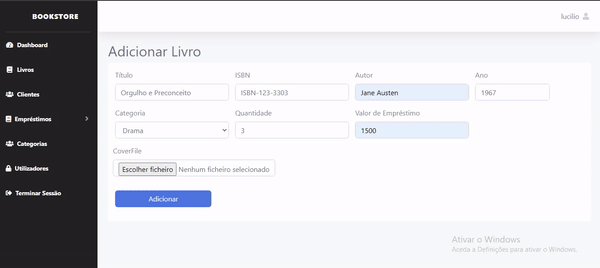

## BookStore - é um  sistema de gestão de uma Biblioteca. 

##  Requisitos Funcionais do Sistema
* Registar Clientes da biblioteca
* Registar livros disponiveis na biblioteca
* Efectuar Emprestimos de livros
* Consultar obras emprestadas
* Registar devolução de livros
* Aplicar multas em caso de atraso na devolução
* Suspender clientes com multas não pagas
* Liquidar multas
* Autenticação e Controle de usuários do sistema
* ...

## Tecnologias e Ferramentas de Desenvolvimento utilizadas:
* C#, ASP.NET CORE v7.0
* SqlServer
* Html, Css
* Bootstrap
* Jquery
* Padrão MVC
##

